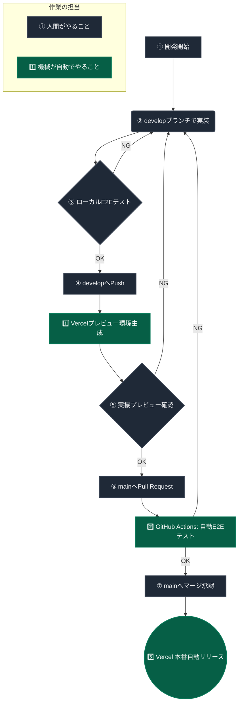

# デプロイ・テスト運用フロー

本プロジェクトでは、「開発したものが安心して本番に反映される」ことを保証するため、以下の4ステップのワークフローを規定する。

## ブランチ戦略
- `develop` ブランチ： 日々の開発用（開発環境）
- `main` ブランチ： 本番公開用（本番環境）

---

## 基本ワークフロー

### ① 開発 (Development)
新機能の追加やバグ修正、UI変更などの開発作業は、必ずローカル環境（`develop` ブランチ）で行う。

### ② 開発環境でのテスト → コミット
ローカルでの実装が完了したら、PlaywrightによるE2E自動テストを実行する。
```bash
npm run test:e2e
```
テストが全て（ビジュアルのズレがないか、機能が壊れていないか）パスしたことを確認してから `develop` ブランチにコミット＆プッシュする。

### ③ 本番相当（プレビュー）でのテスト → 修正
`develop` ブランチをPushすると、Vercelが自動的に「プレビュー用URL（本番と全く同じ仕組みのテスト用サーバー）」を発行する。
このプレビューURLに対して、最終確認（動作確認・テスト）を行う。
もしここで不具合が見つかった場合は、`develop` ブランチで修正コミットを行う。
（※緊急で `main` ブランチに直接修正を入れた場合は、必ず後で `develop` ブランチへ `git pull` して同期させる）

### ④ 本番リリース (Production)
プレビュー環境で完全に問題がない（安心して出せる）ことが確認できたら、GitHub上で `develop` ブランチから `main` ブランチへマージ（Pull Request）を行う。
Vercelが自動で `main` ブランチの変更を検知し、安全に本番環境へリリースする。

---

## 自動化（CI/CD）の導入

GitHub Actions（`.github/workflows/playwright.yml`）を設定し、「コミットした瞬間に自動でPlaywrightが走り、テストに落ちたコードは本番にマージできない」仕組み（CI）を構築済み。



---

## バージョンと履歴の管理（リリースノート）

本番環境のバージョンと変更履歴は、以下の手軽なフローで管理します。

1. **バージョンの採番 (npm version)**
   リリースを行う際、ターミナルで以下のコマンドを実行します。
   ```bash
   # 小さな修正・バグフィックスの場合（例: 1.0.1 -> 1.0.2）
   npm version patch
   
   # 新機能の追加などの中規模アップデートの場合（例: 1.0.2 -> 1.1.0）
   npm version minor
   ```
   このコマンドにより、自動的に `package.json` のバージョンが上がり、Gitタグが作成され、コミットされます。

2. **アプリ画面への表示**
   `vite.config.ts` で `package.json` のバージョン番号を読み取り、画面の一番下（フッターのクレジットの下）に `v1.0.1` のように自動で表示されます。これにより、本番環境で動いているバージョンが一目で確認可能です。

3. **リリースノートの作成 (GitHub Releases)**
   `git push --tags` でタグをGitHubにPushしたあと、GitHubの **Releases** 画面から `Draft a new release` を選び、該当のタグに対して「どんな機能を追加したか」をメモしておくことで、美しい履歴が残ります。
