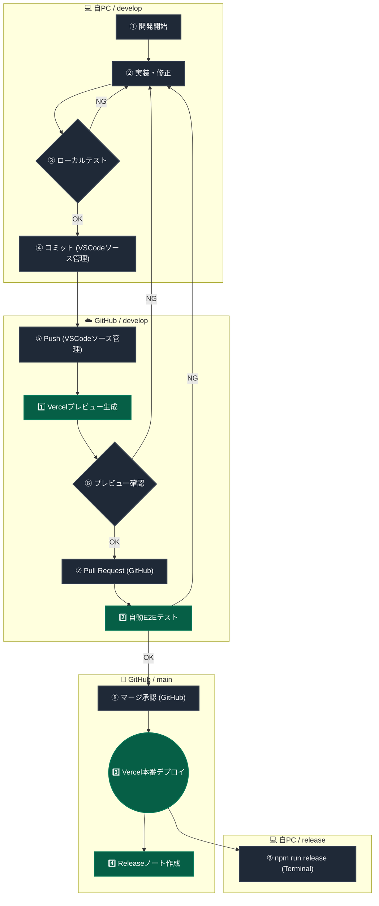

# デプロイ・テスト運用フロー

本プロジェクトでは、「開発したものが安心して本番に反映される」ことを保証するため、以下のワークフローを規定する。

---

## 担当の原則（最重要）

| 作業 | 担当 | 補足 |
|------|------|------|
| コミット（`git commit`） | **人間のみ** | AIは絶対に実行しない |
| プッシュ（`git push`） | **人間のみ** | AIは絶対に実行しない |
| バージョンタグ付け（`npm run release`） | **人間のみ** | リリース時に1回だけ |
| テスト実行（Playwright CI） | 機械が自動 | Push時に自動で走る |
| Vercelデプロイ | 機械が自動 | mainマージ時に自動 |

---

## ブランチ戦略

| ブランチ | 用途 |
|---------|------|
| `develop` | 日々の開発用（開発環境） |
| `main` | 本番公開用（本番環境） |

---

## ワークフロー図



---

## 機械が自動でやること

| # | トリガー | 内容 |
|---|------|------|
| 1️⃣ | developへPush時 | VercelがプレビューURLを自動生成 |
| 2️⃣ | Pull Request作成時 | GitHub ActionsがPlaywright自動テストを実行 |
| 3️⃣ | mainへマージ時 | Vercelが本番環境へ自動デプロイ |
| 4️⃣ | `npm run release`実行時 | GitHubにReleaseノートを自動作成 |

> **Note:** `src/` や `tests/` 以外の変更（OGP画像・ドキュメントなど）ではテストはスキップされる。

---

## ⑨ バージョン付けの詳細（`npm run release`）

本番デプロイ後、**このタイミングで初めてバージョン番号を付ける。** コミットやPushのたびにバージョンを上げる必要はない。

```bash
# 小さな修正・バグフィックス（例: 1.1.1 -> 1.1.2）
npm run release patch

# 新機能追加（例: 1.1.2 -> 1.2.0）
npm run release minor
```

実行すると「📝 リリースノートを入力してください」と聞かれる。入力してEnterを押すだけで、バージョン引き上げ・Push・GitHub Releasesへのノート作成が一撃で完了する。

完了後1〜2分で、アプリ画面のフッターに新しいバージョン番号が表示される。
